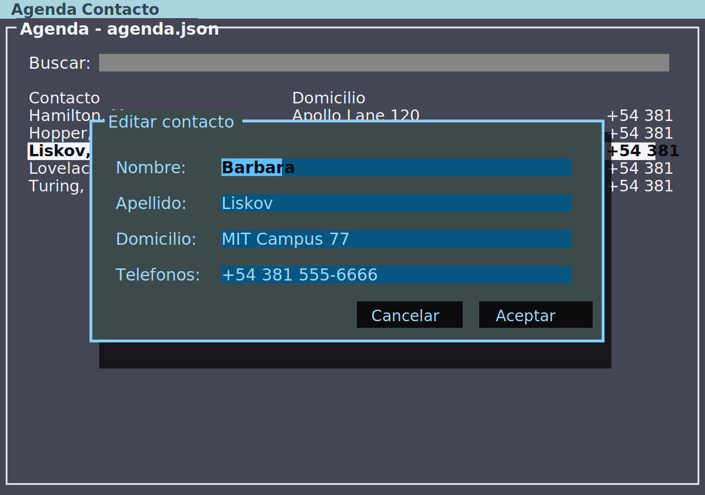
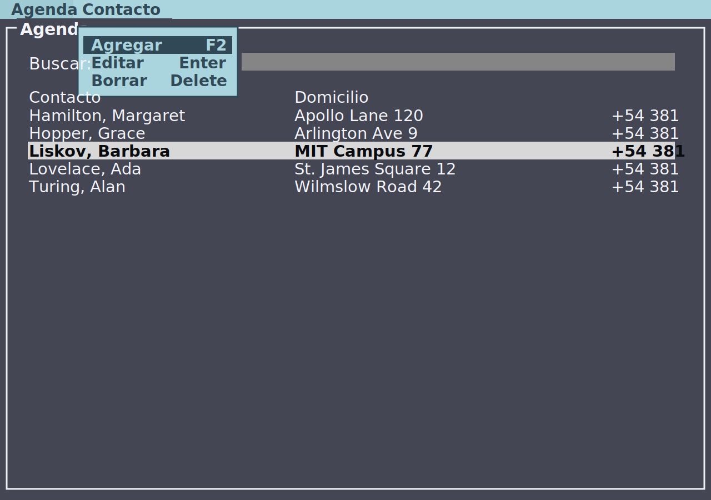

# Trabajo Práctico — Agenda TUI con Terminal.Gui

**Entrega:**  a definir por la cátedra

---

## Descripción

Desarrollar una aplicación de terminal llamada **Agenda** que permita administrar contactos desde una interfaz TUI (*Text User Interface*) usando **Terminal.Gui v2**.

La aplicación debe ser un único archivo `agenda.cs`, implementado como *file-based program* de C#, y debe guardar sus datos en formato JSON.

---

## Sintaxis

```bash
dotnet run agenda.cs -- [archivo.json]
```

---

## Archivo de trabajo

- Si se ejecuta sin parámetros, la aplicación debe trabajar siempre sobre `agenda.json`, ubicado en la misma carpeta que `agenda.cs`.
- Si se pasa un argumento, ese argumento indica el archivo JSON de trabajo.

```bash
dotnet run agenda.cs
dotnet run agenda.cs -- clientes.json
dotnet run agenda.cs -- /tmp/agenda-prueba.json
```

Si `agenda.json` no existe, la aplicación debe intentar cargar `agenda-inicial.json` como datos iniciales y guardar inmediatamente esos datos en `agenda.json`.

---

## Modelo de datos

Cada contacto debe tener:

| Campo | Tipo | Descripción |
|---|---|---|
| `nombre` | `string` | Nombre del contacto. |
| `apellido` | `string` | Apellido del contacto. |
| `domicilio` | `string` | Domicilio del contacto. |
| `telefonos` | `List<string>` | Lista de teléfonos. |

El archivo JSON debe guardar una lista de contactos:

```json
[
  {
    "nombre": "Ada",
    "apellido": "Lovelace",
    "domicilio": "St. James Square 12",
    "telefonos": [
      "+54 381 111-1111",
      "+54 381 111-2222"
    ]
  }
]
```

---

## Interfaz requerida

La aplicación debe usar Terminal.Gui y mostrar:

- Una barra de menú superior.
- Una ventana principal con marco visible.
- Un campo de búsqueda.
- Una lista de contactos.
- Un encabezado de columnas.

La lista debe mostrar columnas alineadas para:

| Columna | Contenido |
|---|---|
| Contacto | Apellido y nombre visibles del contacto. |
| Domicilio | Domicilio del contacto. |
| Teléfonos | Teléfonos separados por coma. |

Los contactos deben ordenarse por `apellido` y luego por `nombre`.

---

## Referencia visual

La interfaz esperada debe parecerse a estas capturas:





---

## Menú

La barra de menú debe tener al menos:

| Menú | Acción | Tecla |
|---|---|---|
| Agenda → Salir | Cierra la aplicación. | `Ctrl+Q` |
| Contacto → Agregar | Agrega un contacto nuevo. | `F2` |
| Contacto → Editar | Edita el contacto seleccionado. | `Enter` |
| Contacto → Borrar | Borra el contacto seleccionado. | `Delete` |

Los marcos de los menús desplegables deben verse correctamente.

---

## Búsqueda

El campo de búsqueda debe filtrar la lista en tiempo real.

La búsqueda debe coincidir contra:

- Nombre.
- Apellido.
- Domicilio.
- Cualquier teléfono.

La comparación debe ignorar mayúsculas y minúsculas.

---

## Alta, edición y baja

### Agregar contacto

Al agregar un contacto se debe abrir un diálogo con:

- Nombre.
- Apellido.
- Domicilio.
- Teléfonos.

Los teléfonos se deben ingresar separados por coma.

### Editar contacto

Al presionar `Enter` sobre la lista o elegir la opción del menú, se debe abrir el mismo diálogo con los datos del contacto seleccionado.

Al aceptar, se deben actualizar los datos del contacto.

### Borrar contacto

Al presionar `Delete` sobre la lista o elegir la opción del menú, se debe pedir confirmación antes de borrar.

Si la terminal envía `Backspace` para la tecla física de borrado, también se acepta como borrado del contacto seleccionado.

---

## Validaciones

- No se debe permitir guardar un contacto sin nombre y sin apellido.
- Si un contacto no tiene domicilio, la lista debe mostrar `(sin domicilio)`.
- Si un contacto no tiene teléfonos, la lista debe mostrar `(sin teléfonos)`.
- Si un contacto no tiene nombre visible, la lista debe mostrar `(sin nombre)`.
- Si el archivo JSON no existe y no hay archivo inicial, la agenda debe empezar vacía.
- Si el archivo JSON está vacío o no se puede leer como lista de contactos, la agenda debe empezar vacía.

---

## Guardado automático

La aplicación debe guardar automáticamente el archivo JSON:

- Al iniciar, para asegurar que exista el archivo de trabajo.
- Después de agregar un contacto.
- Después de editar un contacto.
- Después de borrar un contacto.

No debe ser necesario ejecutar una opción manual de guardado.

---

## Diseño requerido

El programa debe organizarse con funciones locales para las operaciones principales:

```text
1. Resolver archivo de trabajo
2. Cargar agenda desde JSON
3. Construir interfaz Terminal.Gui
4. Refrescar lista y aplicar búsqueda
5. Agregar contacto
6. Editar contacto seleccionado
7. Borrar contacto seleccionado
8. Guardar automáticamente
```

Se permite definir una clase simple `Contacto` para representar el modelo de datos.

---

## Archivo inicial de prueba

Crear un archivo `agenda-inicial.json` en la misma carpeta que `agenda.cs`:

```json
[
  {
    "nombre": "Ada",
    "apellido": "Lovelace",
    "domicilio": "St. James Square 12",
    "telefonos": [
      "+54 381 111-1111",
      "+54 381 111-2222"
    ]
  },
  {
    "nombre": "Alan",
    "apellido": "Turing",
    "domicilio": "Wilmslow Road 42",
    "telefonos": [
      "+54 381 222-2222"
    ]
  },
  {
    "nombre": "Grace",
    "apellido": "Hopper",
    "domicilio": "Arlington Ave 9",
    "telefonos": [
      "+54 381 333-3333",
      "+54 381 333-4444"
    ]
  }
]
```

---

## Casos de prueba mínimos

| Caso | Resultado esperado |
|---|---|
| `dotnet run agenda.cs` sin `agenda.json` | Carga `agenda-inicial.json`, crea `agenda.json` y muestra la agenda. |
| `dotnet run agenda.cs -- prueba.json` | Usa `prueba.json` como archivo de trabajo. |
| Escribir en búsqueda | La lista se filtra en tiempo real. |
| Seleccionar contacto y presionar `Enter` | Abre el diálogo de edición. |
| Seleccionar contacto y presionar `Delete` | Pide confirmación y borra si se acepta. |
| Agregar contacto con `F2` | Lo agrega, refresca la lista y guarda el JSON. |
| Intentar aceptar contacto sin nombre ni apellido | Muestra error y no guarda. |
| Salir y volver a abrir | Los cambios persisten. |

---

## Entrega

- Archivo `agenda.cs` completo.
- Archivo `agenda-inicial.json` con datos de prueba.

> [!NOTE]
> La entrega se ejecuta con `dotnet run agenda.cs -- [archivo.json]`. Si no se indica archivo, debe trabajar sobre `agenda.json`.
